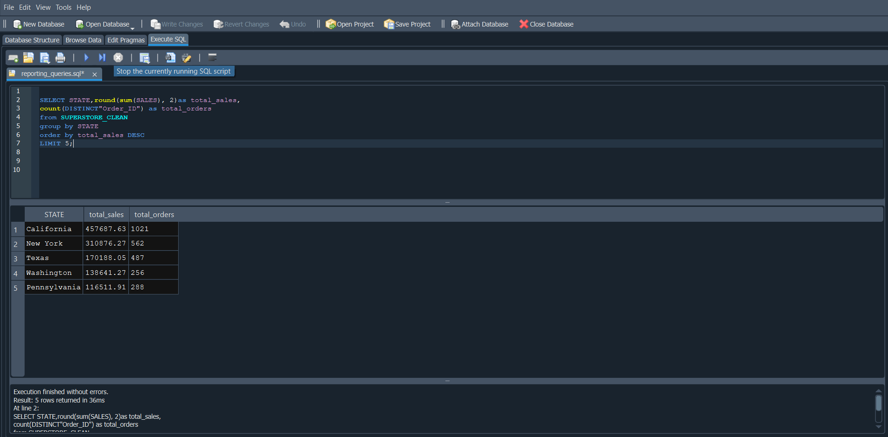
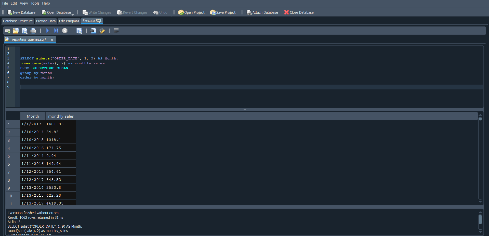
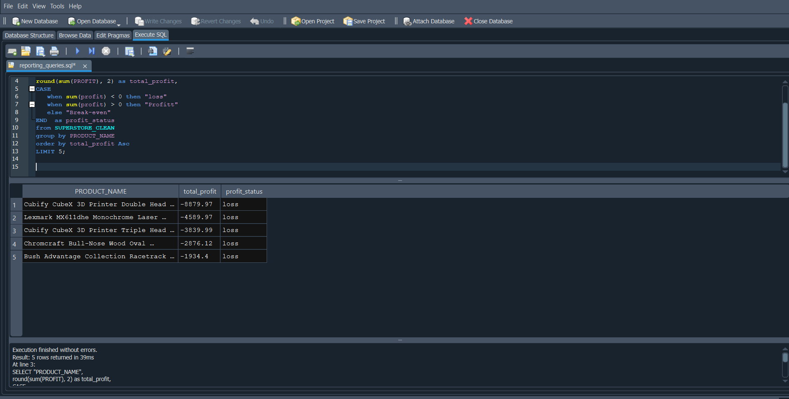
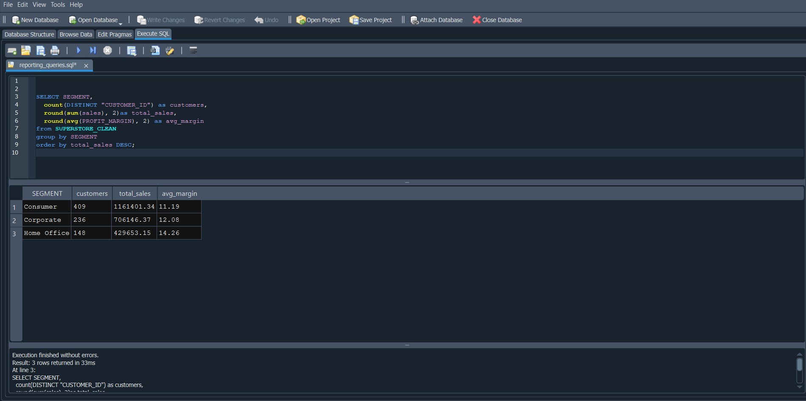
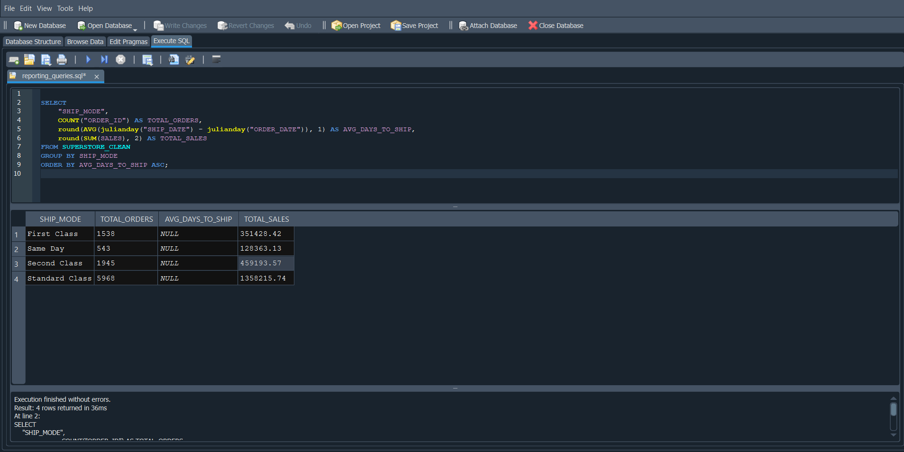
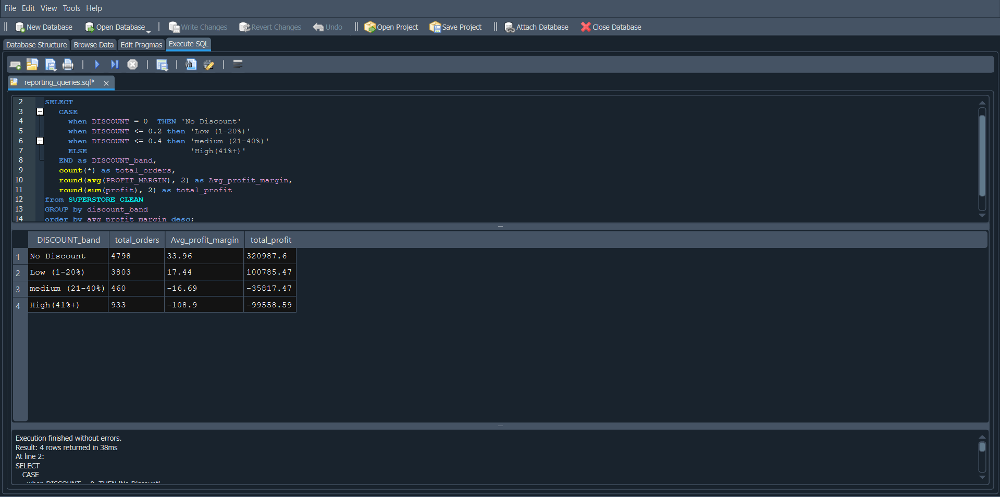
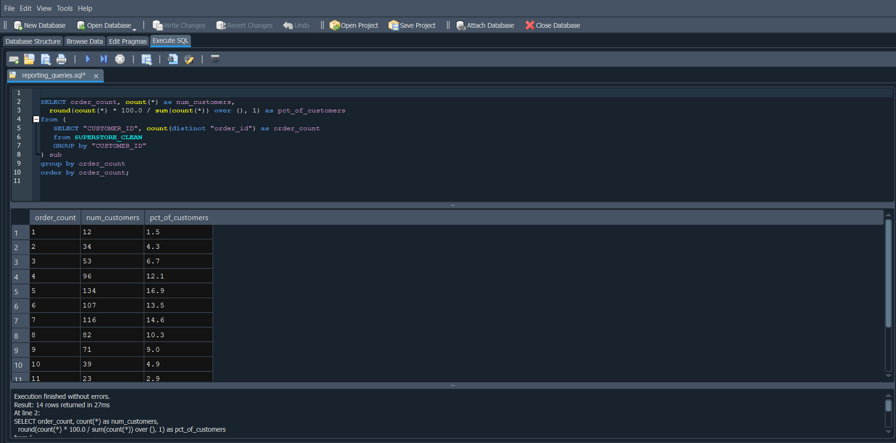
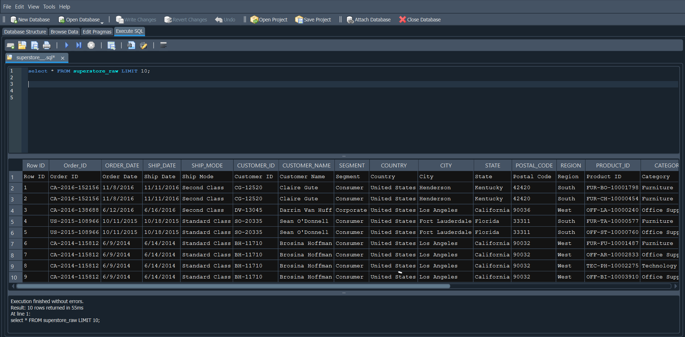
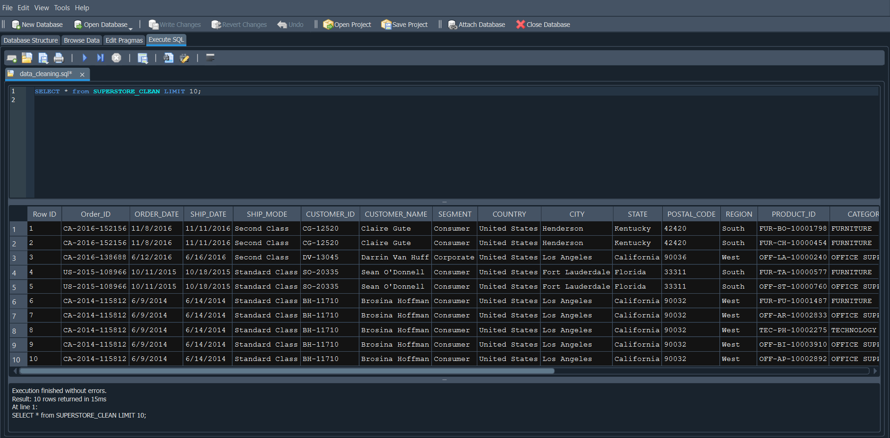
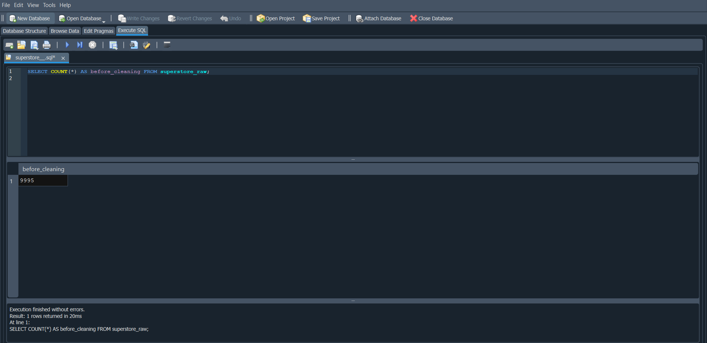

# SQL Data Cleaning + Reporting Project
### Superstore Retail Dataset | SQL · Excel

---

## Project Overview

This project demonstrates end-to-end data cleaning and business reporting using SQL on a real-world retail dataset. The raw Superstore dataset contained 9,994 rows with duplicate records, whitespace issues, inconsistent formatting, and zero-value sales entries. All issues were identified, documented, and resolved using structured SQL queries. Eight business reports were then generated from the clean data to extract actionable insights.

---

## Tools Used

| Tool | Purpose |
|------|---------|
| SQL (SQLite) | Data exploration, cleaning, transformation |
| DB Browser for SQLite | Query execution and result visualization |
| Excel | Final export review and formatting check |
| GitHub | Version control and project showcase |

---

## Dataset

- **Source:** [Kaggle — Sample Superstore Dataset](https://www.kaggle.com/datasets/vivek468/superstore-dataset-final)
- **Rows:** 9,994 (raw) → see cleaning summary below
- **Columns:** 21 (Order ID, Order Date, Ship Date, Ship Mode, Customer ID, Customer Name, Segment, City, State, Region, Category, Sub-Category, Product Name, Sales, Quantity, Discount, Profit)

---

## Problems Found in Raw Data

| Issue | Details | Action Taken |
|-------|---------|--------------|
| Duplicate rows | Multiple identical records | Removed using `SELECT DISTINCT` |
| Whitespace in text columns | Leading/trailing spaces in Customer Name, City, State, Product Name | Cleaned using `TRIM()` |
| Inconsistent category casing | Mixed upper/lower case in Category column | Standardized using `UPPER()` |
| Zero or negative sales | Invalid sales entries (≤ 0) | Removed from clean table |
| Missing profit margin | No margin column existed | Derived new column using `(Profit / Sales) * 100` |

---

## Data Cleaning Steps

All queries are saved in [`data_cleaning.sql`](data_cleaning.sql)

```sql
-- Step 1: Create clean table without duplicates
CREATE TABLE superstore_clean AS
SELECT DISTINCT * FROM superstore;

-- Step 2: Trim whitespace from text columns
UPDATE superstore_clean
SET
  "Customer Name" = TRIM("Customer Name"),
  "Product Name"  = TRIM("Product Name"),
  "City"          = TRIM("City"),
  "State"         = TRIM("State");

-- Step 3: Standardize category names
UPDATE superstore_clean
SET "Category" = UPPER("Category");

-- Step 4: Remove invalid sales rows
DELETE FROM superstore_clean
WHERE Sales <= 0;

-- Step 5: Add profit margin column
ALTER TABLE superstore_clean ADD COLUMN Profit_Margin REAL;
UPDATE superstore_clean
SET Profit_Margin = ROUND((Profit / Sales) * 100, 2);
```

**Before cleaning:** 9,994 rows  
**After cleaning:** _(update with your actual count after running)_

---

## Before vs After

| | Raw Data | Clean Data |
|-|----------|------------|
| Total rows | 9,994 | _(your count)_ |
| Duplicate rows | _(your count)_ | 0 |
| Null/blank entries | _(your count)_ | 0 |
| Profit Margin column | ✗ Not present | ✓ Added |

---

## Business Reports

All 8 reports are saved in [`reporting_queries.sql`](reporting_queries.sql)

### Report 1 — Sales & Profit by Category
```sql
SELECT
  Category,
  ROUND(SUM(Sales), 2)         AS Total_Sales,
  ROUND(SUM(Profit), 2)        AS Total_Profit,
  ROUND(AVG(Profit_Margin), 2) AS Avg_Margin_Pct
FROM superstore_clean
GROUP BY Category
ORDER BY Total_Sales DESC;
```


---

### Report 2 — Top 5 States by Revenue
```sql
SELECT
  State,
  ROUND(SUM(Sales), 2)          AS Total_Sales,
  COUNT(DISTINCT "Order ID")    AS Total_Orders
FROM superstore_clean
GROUP BY State
ORDER BY Total_Sales DESC
LIMIT 5;
```


---

### Report 3 — Monthly Sales Trend
```sql
SELECT
  SUBSTR("Order Date", 1, 7)   AS Month,
  ROUND(SUM(Sales), 2)         AS Monthly_Sales
FROM superstore_clean
GROUP BY Month
ORDER BY Month;
```


---

### Report 4 — Bottom 5 Loss-Making Products
```sql
SELECT
  "Product Name",
  ROUND(SUM(Profit), 2) AS Total_Profit
FROM superstore_clean
GROUP BY "Product Name"
ORDER BY Total_Profit ASC
LIMIT 5;
```


---

### Report 5 — Customer Segment Performance
```sql
SELECT
  Segment,
  COUNT(DISTINCT "Customer ID") AS Total_Customers,
  ROUND(SUM(Sales), 2)          AS Total_Sales,
  ROUND(SUM(Profit), 2)         AS Total_Profit,
  ROUND(AVG(Profit_Margin), 2)  AS Avg_Margin_Pct
FROM superstore_clean
GROUP BY Segment
ORDER BY Total_Sales DESC;
```


---

### Report 6 — Ship Mode Efficiency
```sql
SELECT
  "Ship Mode",
  COUNT("Order ID")                                                AS Total_Orders,
  ROUND(AVG(JULIANDAY("Ship Date") - JULIANDAY("Order Date")), 1) AS Avg_Days_To_Ship,
  ROUND(SUM(Sales), 2)                                            AS Total_Sales
FROM superstore_clean
GROUP BY "Ship Mode"
ORDER BY Avg_Days_To_Ship ASC;
```


---

### Report 7 — Discount Impact on Profit
```sql
SELECT
  CASE
    WHEN Discount = 0    THEN 'No Discount'
    WHEN Discount <= 0.2 THEN 'Low (1-20%)'
    WHEN Discount <= 0.4 THEN 'Medium (21-40%)'
    ELSE                      'High (41%+)'
  END AS Discount_Band,
  COUNT(*)                     AS Total_Orders,
  ROUND(AVG(Profit_Margin), 2) AS Avg_Profit_Margin,
  ROUND(SUM(Profit), 2)        AS Total_Profit
FROM superstore_clean
GROUP BY Discount_Band
ORDER BY Avg_Profit_Margin DESC;
```


---

### Report 8 — Repeat Customer Analysis
```sql
SELECT
  order_count,
  COUNT(*)                                                   AS num_customers,
  ROUND(COUNT(*) * 100.0 / SUM(COUNT(*)) OVER (), 1)       AS pct_of_customers
FROM (
  SELECT "Customer ID", COUNT(DISTINCT "Order ID") AS order_count
  FROM superstore_clean
  GROUP BY "Customer ID"
) sub
GROUP BY order_count
ORDER BY order_count;
```


---

## Key Insights

1. **Technology category drives the most revenue** but has a lower profit margin compared to Office Supplies — high sales volume does not always mean high profitability.

2. **California, New York, and Texas** are the top 3 revenue-generating states, together accounting for a significant share of total sales.

3. **Tables sub-category is the biggest loss-maker** despite moderate sales volume — products being sold at a net loss every transaction.

4. **Heavy discounts (40%+) result in negative profit margins** — discount bands above 40% consistently produced losses, indicating a need for a revised discounting strategy.

5. **Consumer segment generates the highest sales**, but the Corporate segment delivers better profit margin efficiency per order.

6. **Same Day shipping is fastest** but carries the fewest orders — Standard Class handles the majority of revenue volume.

7. **Most customers are repeat buyers** — indicating strong customer loyalty within this retail dataset.

---

## Screenshots

### Raw Data (Before Cleaning)


### Clean Data (After Cleaning)


### Row Count: Before vs After


---

## Repository Structure

```
sql-data-cleaning-superstore/
│
├── README.md                    ← You are here
├── data_cleaning.sql            ← All cleaning queries with comments
├── reporting_queries.sql        ← 8 business report queries
├── superstore_cleaned.csv       ← Final clean dataset
│
└── screenshots/
    ├── raw_data_preview.png
    ├── cleaned_data_preview.png
    ├── row_count_comparison.png
    ├── report1_category_sales.png
    ├── report2_top_states.png
    ├── report3_monthly_trend.png
    ├── report4_loss_products.png
    ├── report5_segment_performance.png
    ├── report6_ship_mode.png
    ├── report7_discount_impact.png
    └── report8_repeat_customers.png
```

---

## Skills Demonstrated

- Data profiling and quality assessment
- Duplicate detection and removal
- Text standardization and formatting
- Derived column creation using SQL expressions
- Aggregation and grouping for business reporting
- Time-series analysis using date functions
- Window functions for percentage calculations
- Business insight generation from clean data

---

## Connect

**LinkedIn:** _(add your LinkedIn URL)_  
**GitHub:** _(add your GitHub profile URL)_

---

*Dataset source: Kaggle — Sample Superstore | Tool: DB Browser for SQLite*
